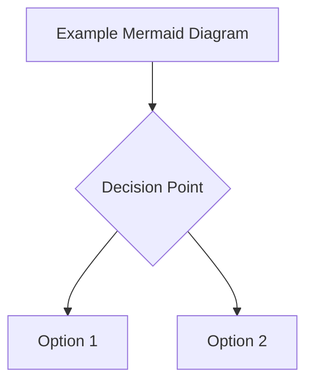

# Chapter Template: Replace with Chapter Title

## Learning Objectives
After completing this chapter, you will be able to:
1. [Learning objective 1 - 3-5 measurable outcomes]
2. [Learning objective 2]
3. [Learning objective 3]
4. [Learning objective 4]
5. [Learning objective 5]

## Conceptual Explanation
[Provide intuition-first explanation of the topic with high-level reasoning before diving into technical details]

## Technical Content
[Include diagrams, flowcharts, or architecture overviews]
[Code snippets (if applicable), equations, formulas]
[Standards & best practices]

## Practical Examples / Humanoid Context
[Real-world robotics or AI examples]
[Use-cases and scenarios aligned with the book's theme]
[Specific examples related to humanoid robots]

## System-Level Architecture Perspective
[Full-stack reasoning: perception → cognition → planning → control → actuation]
[How this chapter's topic fits into the larger robotic system]

## Practical Reasoning / Design Thinking
[Step-by-step design considerations and applied reasoning]
[Trade-offs and design decisions]
[Implementation strategies]

## Failure Modes & Debugging Tips
[Common mistakes]
[Troubleshooting steps]
[How to avoid common pitfalls]
[Error handling strategies]

## Exercises
[Beginner → advanced exercises]

### Beginner
1. [Beginner exercise 1]
2. [Beginner exercise 2]

### Intermediate
1. [Intermediate exercise 1]
2. [Intermediate exercise 2]

### Advanced
1. [Advanced exercise 1]
2. [Advanced exercise 2]

## Multiple Choice Question (MCQs)
[5-10 multiple choice questions with answers and explanations]

**Question 1:** [Question text]
   - a) [Option a]
   - b) [Option b]
   - c) [Option c]
   - d) [Option d]
   - **Correct Answer:** [a/b/c/d]
   - **Explanation:** [Why this is correct]

**Question 2:** [Question text]
   - a) [Option a]
   - b) [Option b]
   - c) [Option c]
   - d) [Option d]
   - **Correct Answer:** [a/b/c/d]
   - **Explanation:** [Why this is correct]

[Continue for 10 MCQs total]

## Chapter Summary
[Key takeaways]
[Concept reinforcement]
[Brief recap of main points]

## Citations
[IEEE numeric style references with clickable DOI/URL wherever possible]

[1] A. Author, B. Author, and C. Author, "Paper title," *Journal/Conference Name*, pp. xx-xx, Year.

[2] A. Author, B. Author, and C. Author, "Paper title," *Journal/Conference Name*, pp. xx-xx, Year.

[3] Organization Name, "Document title," Website Name. [Online]. Available: https://example.com. [Accessed: Date].

## Recent Developments
[Update timeline and recent advances in the field]
[Latest research findings or technological developments]
[Future directions and emerging trends]

## Optional Sections
### Lab Implementation Notes
[Detailed instructions for lab exercises]
[Hardware/software requirements]
[Troubleshooting for lab setup]

### Suggested Further Reading
[Additional resources for deeper understanding]
[Related chapters or external resources]
[Advanced topics for interested readers]